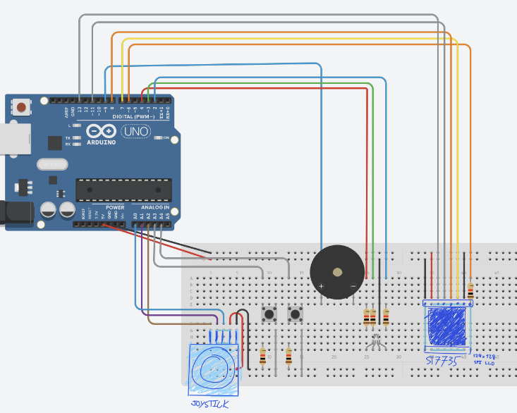
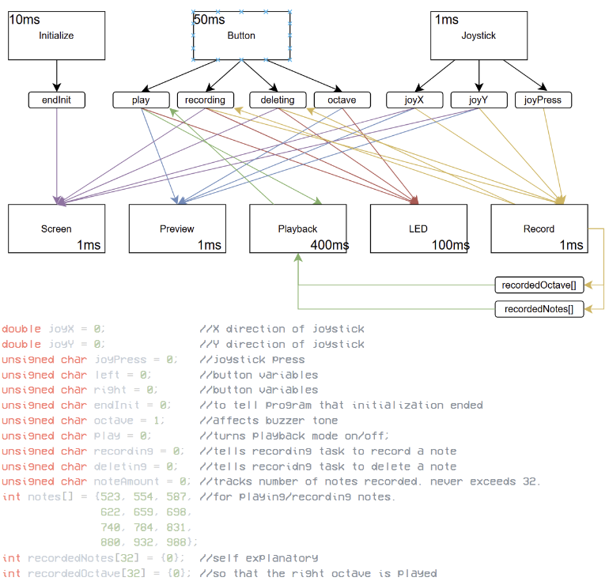
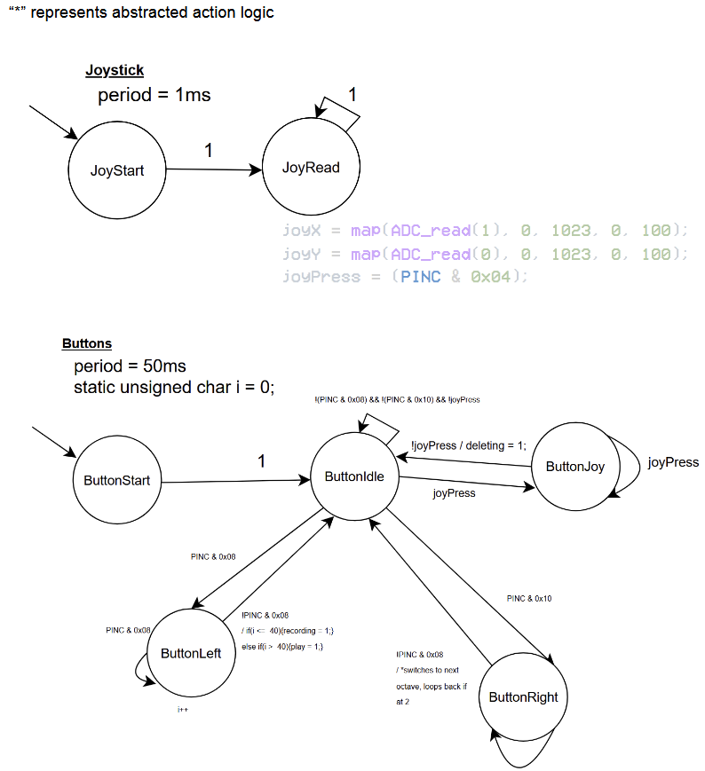
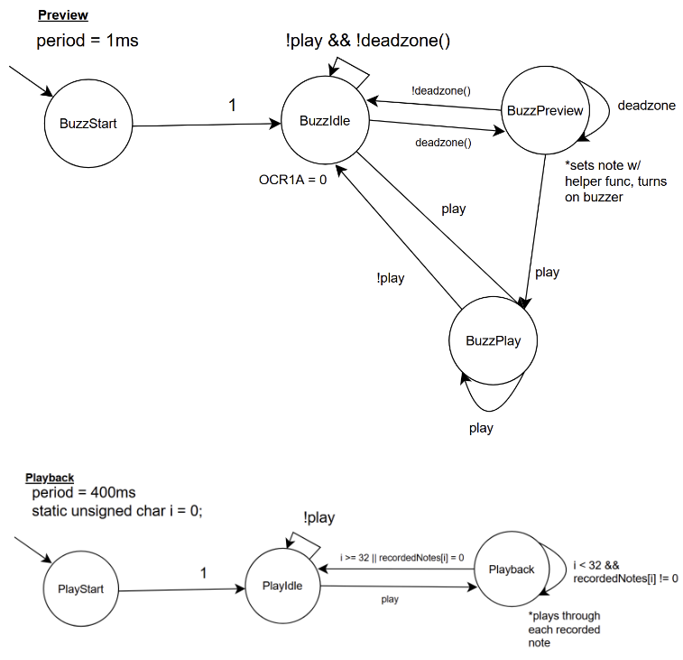
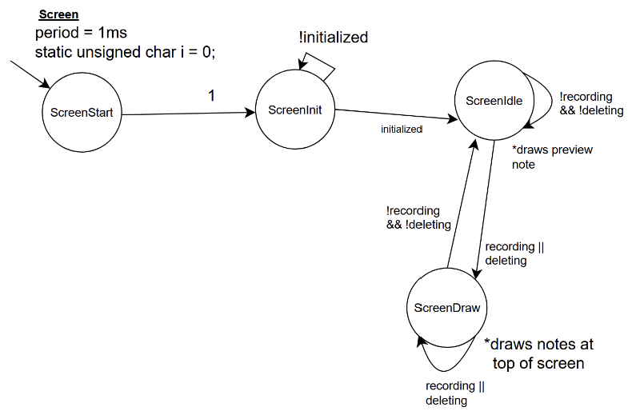
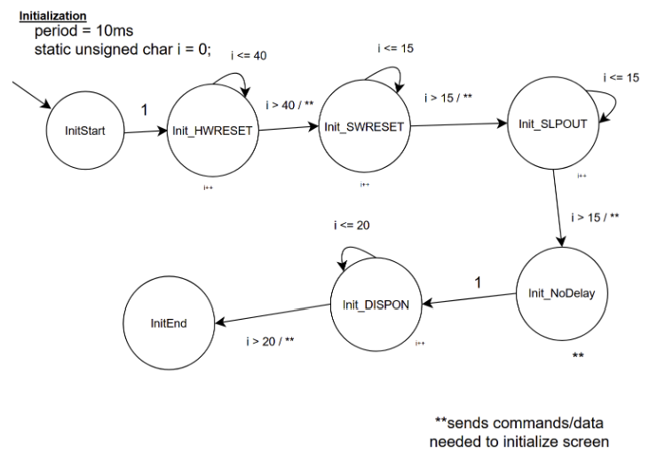
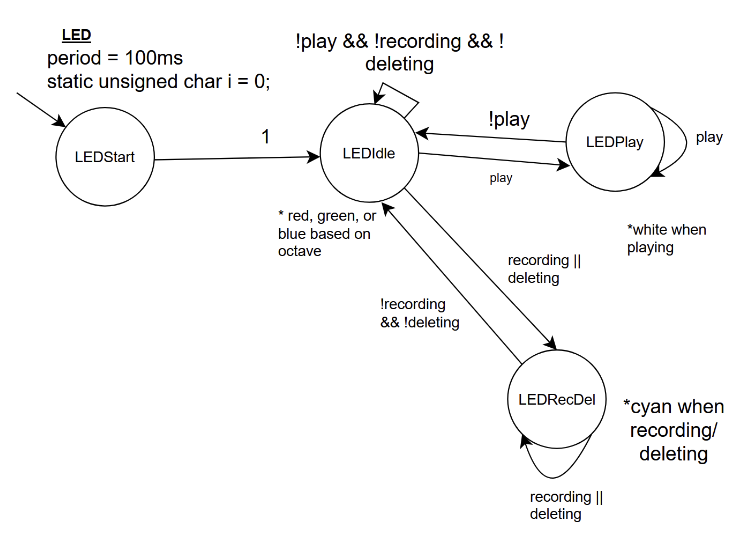
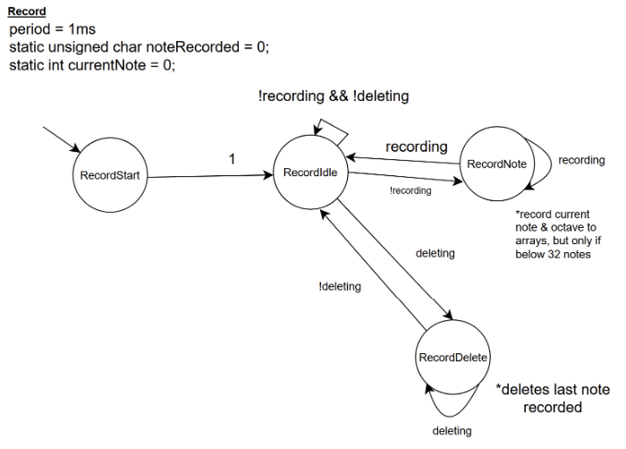

# Arduino Uno Song Recorder
This project is an instrument/recorder that can both play notes on command and record them for later
playback. All of this is output on a buzzer which plays tones based on the direction of the joystick. The
note being played, the most recent note, the current octave/pitch of the notes, the amount of notes
recorded, and their octave are all displayed on a small LCD screen.

## Demo Video
We were required to keep the demos as close to a minute as possible
https://www.youtube.com/shorts/hJHvzhkA0eQ

## Elements of Complexity
ST7735 128x128 SPI LCD Screen
- Displays the majority of information that the user needs

## User Guide
The user plays a note by pointing the joystick in a given direction. Starting from directly down, and going
in a full circle, every note between C4 and B4 can be played. While the user is tilting the joystick, the
note is played through the buzzer, and the note being played flashes in the middle of the screen

When the user wants to change the octave of the note being played/recorded, the user will press the right
button, where it will cycle between octaves starting at C4, C5, and C3. The LED will shine either blue,
green, or red so they know what octave they’re in

When the user wants to record a note, they point in the direction of the note they want to record, let go of
the joystick, and press the left button briefly. A block at the top of the screen will be drawn, whose color
will be that of the current octave, and the LED will flash cyan for a brief moment. No more than 32 notes
can be recorded at a given time.

When the user wants to delete a note, they press down on the joystick. The right-most block in the top of
the screen is cleared, and the LED flashes cyan briefly
When the user wants to play the recorded notes, they will hold down the left button for at least two
seconds, and the song will play when released. Notes will play sequentially, and the LED will be white for
as long as the song plays for.

## Hardware Components Used
Input:
- 2 push buttons
- 1 joystick potentiometer

Output:
- 1 passive buzzer
- 1  RGB LED
- 1 ST7735 128x128 LCD screen

Misc:
- 6 220 ohm resistors

## Software Libraries Used
only math.h to calculate the direction the joystick is pointed in
the point of this assignment was to minimize library use, and to only use AVR libraries

## Wiring Diagram
(tinkercad doesn't have a joystick or LCD screen)

## Task & State Diagrams

